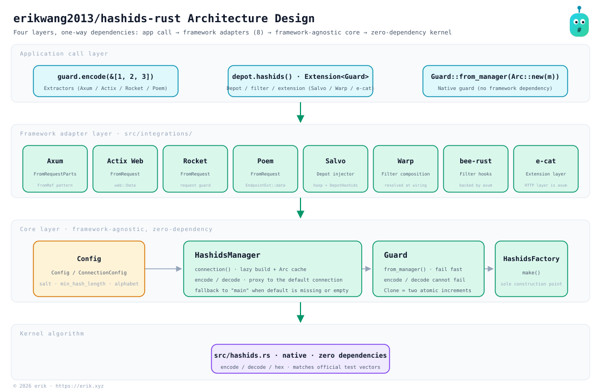
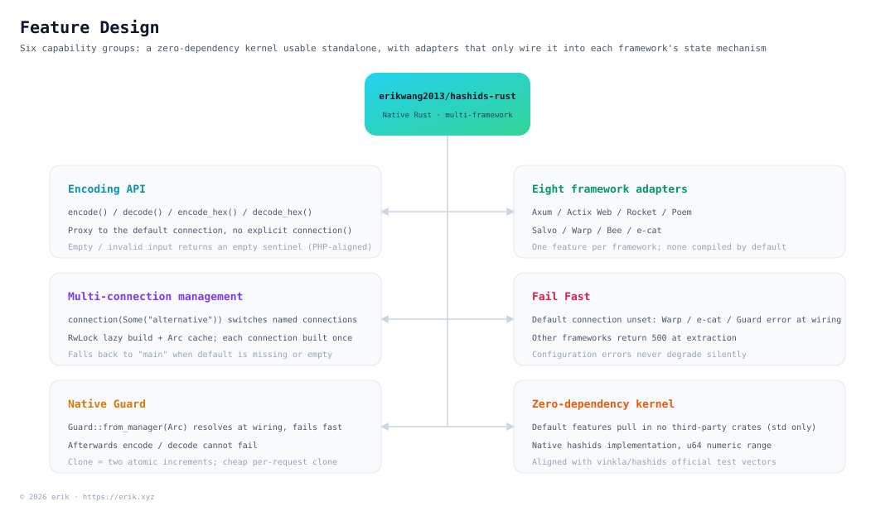
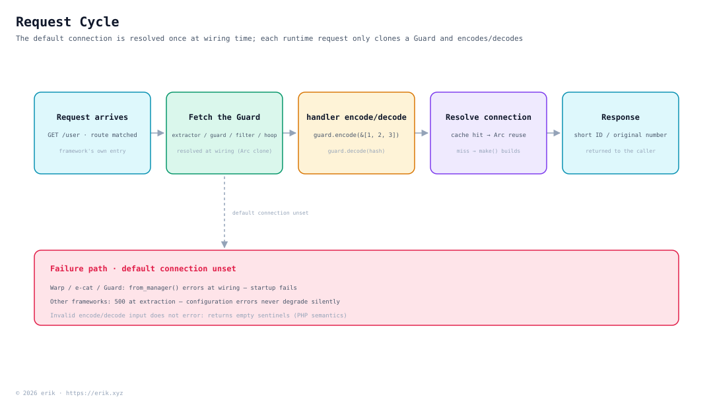
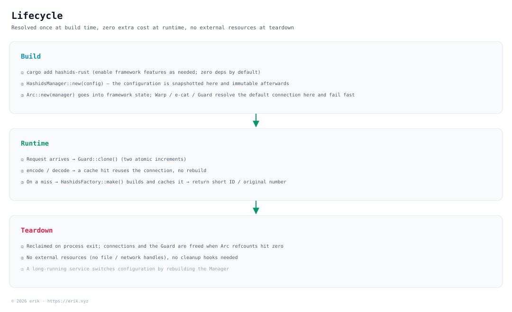

# erikwang2013/hashids-rust

[](https://github.com/erikwang2013/hashids-rust/actions/workflows/test.yml)
[](https://github.com/erikwang2013/hashids-rust/releases)
[](https://crates.io/crates/hashids-rust)
[](https://docs.rs/hashids-rust)

[](../../../LICENSE)

**Languages:** [中文](../../../README.md) · **English**

<p align="center">
  
</p>

<p align="center"><strong>Hashy</strong> — the project mascot; the <code>#</code> on its chest is its signature</p>

Turn database auto-increment IDs into short, unguessable strings, with **a single API running on Axum, Actix Web, Rocket, Poem, Salvo, Warp, bee-rust, and e-cat at the same time**.

The kernel implements the hashids algorithm natively (aligned with the official test vectors of [vinkla/hashids](https://github.com/vinkla/hashids)); configuration and usage follow [**vinkla/hashids**](https://github.com/vinkla/laravel-hashids) (multiple connections, default connection, `HashidsManager` + factory), so migration cost is low. With default features, **zero third-party dependencies**.

## About

**Hashids** is a short ID generator that encodes numeric IDs (such as database primary keys) into short, unique, unguessable strings. Unlike UUIDs or Snowflake IDs, Hashids fits user-facing scenarios better (URLs, share codes, order numbers, and so on): it keeps the output short and readable while hiding the original number.

This package, `erikwang2013/hashids-rust`, is a **native Rust implementation of Hashids with a multi-framework integration layer**. Its design references and aligns with the API style of [vinkla/hashids](https://github.com/vinkla/laravel-hashids) (multiple connections, default connection, Manager + Factory pattern), and adapts the web frameworks commonly used in the Rust ecosystem.

**Core features:**

- **Multi-framework compatibility**: the same API supports Axum, Actix Web, Rocket, Poem, Salvo, Warp, bee-rust, and e-cat; for frameworks without an adapter, the native `Guard` is enough to integrate — migration cost is minimal.
- **Multiple connections**: one application can configure several salt/length combinations at once (e.g. different salts for user IDs and order IDs), switched via `connection(Some("xxx"))`.
- **No framework dependency**: usable standalone without depending on any particular framework — `HashidsManager::new(config)` just works; with default features, zero third-party dependencies.
- **Aligned with vinkla/hashids**: `Config`, connection configuration (`salt` / `min_hash_length` / `alphabet`), and the structure of `HashidsManager` + `HashidsFactory` match vinkla/hashids, so semantics migrate smoothly.
- **Framework-native style**: each integration follows its framework's idioms — Axum uses extractors, Actix Web uses `FromRequest`, Rocket uses request guards, Poem uses extractors, Salvo uses a Depot injector, Warp uses Filters, bee-rust uses native Filter hooks, and e-cat uses an Extension layer.

**Use cases:**

| Scenario | Description |
|------|------|
| Hide auto-increment database IDs | Map `user_id=100` to `/user/3kTMd`, avoiding exposure of business scale |
| Generate short links / share codes | Shorter than UUIDs, more controllable than random strings |
| Order numbers / serial numbers | Good readability, easier for customer support and log triage |
| Multi-tenant / multi-module isolation | Different connections use different salts, keeping encoding spaces independent |

**Caveats:**

- Hashids is **encoding (encode/decode), not encryption**. The salt only raises the guessing difficulty; it is not suitable for security-sensitive scenarios (such as tokens or passwords).
- Once in production, changing the salt or length invalidates every ID already encoded — plan ahead and freeze the configuration.
- **An empty salt means no protection**: with an empty salt the encoding is enumerable (`encode(1)`, `encode(2)`, … in a predictable order). An empty salt neither errors nor warns; it degrades silently — confirm the salt is set before shipping.
- **Configuration is snapshotted at construction**: `HashidsManager` configuration is fixed once constructed (`set_default_connection` must also be called before wrapping it in an `Arc`); changing configuration requires rebuilding the Manager — likewise for long-running services, the change takes effect after a rebuild.
- **Numeric range is `u64`**: the arbitrary precision of the PHP version's bcmath/gmp is not replicated; the official test vectors (including `u64::MAX`) all fit within `u64`, losslessly.

## Project Structure

```
hashids-rust/
├── src/
│   ├── lib.rs                       # crate docs and re-exports
│   ├── hashids.rs                   # core algorithm: encode/decode/encode_hex/decode_hex
│   ├── config.rs                    # Config / ConnectionConfig (default + connections)
│   ├── error.rs                     # Error (mirrors the PHP version's error semantics and messages)
│   ├── factory.rs                   # HashidsFactory: the single construction point
│   ├── manager.rs                   # core: multi-connection resolution, instance cache, default-connection proxy
│   ├── guard.rs                     # native Guard (request guard): a framework-free entry point
│   ├── mascot.rs                    # ASCII edition of the project mascot “Hashy”
│   └── integrations/                # eight framework adapters (all feature-gated, wiring only)
│       ├── axum.rs · actix.rs · rocket.rs · poem.rs
│       ├── salvo.rs · warp.rs
│       └── bee.rs (bee-rust) · ecat.rs (e-cat, backed by axum)
├── tests/
│   ├── vectors.rs                   # official test vectors (full transcription of vinkla/hashids)
│   ├── manager.rs · guard.rs · factory.rs · mascot.rs
│   └── integrations/                # one end-to-end case per framework
├── docs/
│   ├── mascot.svg                   # the project mascot “Hashy”
│   ├── architecture.svg             # architecture diagram
│   ├── features.svg                 # feature design diagram
│   ├── request-cycle.svg            # request cycle diagram
│   ├── lifecycle.svg                # lifecycle diagram
│   ├── i18n/                        # 12-language READMEs (each with localized diagrams)
│   ├── weixinpay.png · alipay.png   # sponsorship QR codes
├── .github/workflows/               # test / release
├── Cargo.toml
└── LICENSE
```

## Architecture



**Four layers with one-way dependencies**: each layer depends on the layer below, never the reverse:

| Layer | Responsibility | Location |
|----|------|------|
| Application call layer | extractors, `Extension`, `Depot`, `Guard` clones, and other entry points | application code |
| Framework adapter layer | wiring only: state registration, request guards, injection | `src/integrations/` |
| Core layer | multi-connection management and instance construction, **framework-agnostic** | `src/manager.rs`, `src/factory.rs`, `src/guard.rs` |
| Kernel algorithm | the actual encode/decode implementation, **zero dependencies** | `src/hashids.rs` |

The core layer is the package's center of gravity: `HashidsManager` holds the configuration, `connection()` builds and caches connections on demand (`Arc` reuse), and proxy methods such as `encode()/decode()` forward to the default connection; `HashidsFactory::make()` is the only place a `Hashids` is constructed. `Guard` resolves the default connection once at wiring time and fails fast, after which encode/decode cannot fail. The eight framework adapters add up to roughly 400 lines — their only job is wiring the kernel into each framework's state mechanism.

## Feature Design



Six capability groups, all built around the same kernel:

- **Encoding API**: `encode()` / `decode()` / `encode_hex()` / `decode_hex()`; proxy methods land on the default connection, no explicit `connection()` needed.
- **Multi-connection management**: switch with `connection(Some("alternative"))`; built lazily, each connection is constructed only once.
- **Native Guard**: a framework-independent request guard that works by dropping it into any framework's application state and cloning it per request; all eight adapters produce a `Guard`.
- **Eight framework adapters**: Axum uses `FromRequestParts`, Actix Web uses `FromRequest`, Rocket uses a `FromRequest` guard, Poem uses `FromRequest`, Salvo uses a Depot injector (`.hoop()`), Warp uses a Filter, bee-rust uses native `Filter` hooks, and e-cat uses an `Extension` layer — each following its framework's idioms.
- **Fail fast**: when the default connection is not configured, Warp errors at wiring time, e-cat/Guard errors at wiring time, and the remaining frameworks return 500 at extraction — a configuration error never degrades silently.
- **Zero-dependency kernel**: `HashidsManager::new(config)` just works; default features pull in no third-party crates.

## Request Cycle



A request does exactly three things: **take the Guard** (extractor / guard / filter / hoop — the default connection was already resolved and cached at wiring time) → **encode or decode** (`encode()` / `decode()` land on the default connection) → **return** the short ID or the original number. A connection is built through `HashidsFactory::make()` and written to the cache only the first time it is used.

When the default connection is not configured there is no silent degradation: Warp / e-cat / Guard error out at wiring time (startup fails), while the other frameworks return 500 at extraction; invalid input to encode/decode itself, by contrast, returns empty sentinels per PHP semantics — the two kinds of failure are never conflated.

## Lifecycle



| Phase | What happens |
|------|-----------|
| **Build** | Install `hashids-rust` with the framework features you need → `HashidsManager::new(config)` at startup → wrap it in `Arc` and place it in framework state; Warp / e-cat / Guard resolve the default connection here and fail fast |
| **Runtime** | Request → extractor/guard/filter takes out a `Guard` → `encode()` / `decode()` → **a cache hit reuses the connection directly; only a miss triggers `HashidsFactory::make()` to build it and write it to the cache** → return the short ID or the original number |
| **Teardown** | Reclaimed on process exit; no external resources to clean up |

Connections are built **on demand**: a process that only calls the default connection pays no construction cost for unused connections such as `alternative`.

## Installation

```bash
cargo add hashids-rust
```

Or write it straight into `Cargo.toml` (pinning the major version):

```toml
[dependencies]
hashids-rust = "1.0"
```

Enable framework adapters as needed (none are compiled by default):

| feature | Framework | Registration |
|---------|------|----------|
| `axum` | Axum 0.8 | `Router::with_state(Arc::new(manager))` |
| `actix` | Actix Web 4 | `App::app_data(web::Data::new(manager))` |
| `rocket` | Rocket 0.5 | `rocket::build().manage(Arc::new(manager))` |
| `poem` | Poem 3 | `Route::data(Arc::new(manager))` |
| `salvo` | Salvo 1 | `Router::hoop(HashidsInjector::new(manager))` |
| `warp` | Warp 0.4 | `hashids(manager)` → Filter |
| `bee` | bee-rust (`bee_router` 1) | `HashidsFilter` or use with the axum extractor directly |
| `ecat` | e-cat (`ecat` 4) | `router.layer(hashids_layer(guard))` |

> **Runtime requirements**: the core (default features) requires Rust **1.85+**. The MSRV of each framework adapter follows the framework crate itself — Actix Web 4.15 needs **1.88+** and Salvo 1.0 needs **1.94+**, so `--all-features` effectively targets the highest, **1.94**.
>
> **Package name**: crates.io hosts another `hashids` crate under the same name, unmaintained since 2015. This package's actual crate name is `hashids-rust`, with the library name `hashids` (write `use hashids::...` in code); mind the distinction when depending on both.

## Configuration

**Isomorphic** with the PHP version's configuration (a root-level `default` plus `connections`, each connection entry carrying `salt` / `length` / `alphabet`) — only turned from an array into typed structs:

```rust
use hashids::{Config, ConnectionConfig};

let config = Config::new()
    .default_connection("main")
    .connection("main", ConnectionConfig::new().salt("").min_hash_length(0))
    // Optional custom alphabet:
    .connection(
        "alternative",
        ConnectionConfig::new()
            .salt("your-salt-string")
            .min_hash_length(6)
            .alphabet("abcdefghijklmnopqrstuvwxyzABCDEFGHIJKLMNOPQRSTUVWXYZ1234567890"),
    );
```

- `default`: the default connection name (e.g. `main`); when absent or empty it is treated as `main` (aligned with vinkla/hashids).
- `connections`: connection name => `salt`, `min_hash_length` (the PHP configuration key is `length`), and an optional `alphabet`.

## Native Usage (Guard)

With no framework dependency, use the manager or the native guard directly:

```rust
use std::sync::Arc;

use hashids::{Config, ConnectionConfig, Guard, HashidsManager};

let manager = Arc::new(HashidsManager::new(
    Config::new().connection("main", ConnectionConfig::new().salt("this is my salt")),
));

// Option 1: use the Manager directly (resolves the default connection on every call, may fail)
let hash = manager.encode(&[1, 2, 3])?;
let ids = manager.decode(&hash)?;

// Option 2: Guard — resolves the default connection at wiring time and fails fast; encode/decode cannot fail afterwards
let hashids = Guard::from_manager(manager)?;
let hash = hashids.encode(&[1, 2, 3]);
let ids = hashids.decode(&hash);
```

---

## Axum

Extractor: put `Arc<HashidsManager>` into application state and write `Hashids` directly as a handler parameter.

```rust
use std::sync::Arc;

use axum::{routing::get, Router};
use hashids::integrations::axum::Hashids;
use hashids::{Config, ConnectionConfig, HashidsManager};

let manager = Arc::new(HashidsManager::new(
    Config::new().connection("main", ConnectionConfig::new().salt("this is my salt")),
));

let app = Router::new()
    .route(
        "/user",
        get(|hashids: Hashids| async move { hashids.0.encode(&[1, 2, 3]) }),
    )
    .with_state(manager);
```

When your application state is your own `AppState`, just add an `impl FromRef<AppState> for Arc<HashidsManager>` (the standard axum pattern).

---

## Actix Web

Register with `App::app_data(web::Data::new(manager))` and write `Hashids` directly as a handler parameter.

```rust
use actix_web::{App, web};
use hashids::integrations::actix::Hashids;
use hashids::{Config, ConnectionConfig, HashidsManager};

let manager = HashidsManager::new(
    Config::new().connection("main", ConnectionConfig::new().salt("this is my salt")),
);

async fn show(ids: Hashids) -> String {
    ids.0.encode(&[1, 2, 3])
}

let app = App::new()
    .app_data(web::Data::new(manager))
    .route("/user", web::get().to(show));
```

---

## Rocket

Register managed state with `rocket::build().manage(Arc::new(manager))` and write `Hashids` directly as a route function parameter.

```rust
use std::sync::Arc;

use hashids::integrations::rocket::Hashids;
use hashids::{Config, ConnectionConfig, HashidsManager};

let manager = Arc::new(HashidsManager::new(
    Config::new().connection("main", ConnectionConfig::new().salt("this is my salt")),
));

#[rocket::get("/user")]
fn user(hashids: Hashids) -> String {
    hashids.0.encode(&[1, 2, 3])
}

let rocket = rocket::build().manage(manager).mount("/", rocket::routes![user]);
```

---

## Poem

Register with `EndpointExt::data(Arc::new(manager))` and write `Hashids` directly as a handler parameter.

```rust
use std::sync::Arc;

use hashids::integrations::poem::Hashids;
use hashids::{Config, ConnectionConfig, HashidsManager};
use poem::{EndpointExt, Route, get};

let manager = Arc::new(HashidsManager::new(
    Config::new().connection("main", ConnectionConfig::new().salt("this is my salt")),
));

async fn index(hashids: Hashids) -> String {
    hashids.0.encode(&[1, 2, 3])
}

let app = Route::new().at("/user", get(index)).data(manager);
```

---

## Salvo

Salvo has no general extractor trait; the idiomatic approach is **Depot**: mount `HashidsInjector` on the Router as middleware, and it injects a `Guard` into the Depot on every request.

```rust
use std::sync::Arc;

use hashids::integrations::salvo::{DepotHashids, HashidsInjector};
use hashids::{Config, ConnectionConfig, HashidsManager};
use salvo::prelude::*;

let manager = Arc::new(HashidsManager::new(
    Config::new().connection("main", ConnectionConfig::new().salt("this is my salt")),
));

#[salvo::handler]
async fn user(depot: &mut Depot) -> String {
    depot.hashids().expect("guard injected").0.encode(&[1, 2, 3])
}

let router = Router::new()
    .hoop(HashidsInjector::new(manager))
    .push(Router::with_path("/user").get(user));
```

When the default connection is not configured, the injector short-circuits the request with a 500 rather than letting it through silently.

---

## Warp

Warp has no extractor trait; the idiomatic approach is a filter chain. `hashids()` produces a Filter carrying `Hashids` and resolves the default connection **at wiring time** (returning an error immediately when it is not configured — fail fast).

```rust
use std::sync::Arc;

use hashids::integrations::warp::{Hashids, hashids};
use hashids::{Config, ConnectionConfig, HashidsManager};
use warp::Filter;

let manager = Arc::new(HashidsManager::new(
    Config::new().connection("main", ConnectionConfig::new().salt("this is my salt")),
));

let route = warp::get()
    .and(warp::path("user"))
    .and(hashids(manager)?)
    .map(|ids: Hashids| ids.0.encode(&[1, 2, 3]));
```

---

## bee-rust

[`bee_router`](https://github.com/erikwang2013/bee-rust) is built on axum 0.8 under the hood: a handler is an axum handler, so it works directly with the `axum` extractor above; on the native bee-rust side there is `HashidsFilter` — it injects a `Guard` into the request extensions of every `Context::dispatch`.

```rust
use std::sync::Arc;

use bee_router::Filter;
use hashids::integrations::bee::{ContextHashids, HashidsFilter};
use hashids::{Config, ConnectionConfig, Guard, HashidsManager};

let manager = Arc::new(HashidsManager::new(
    Config::new().connection("main", ConnectionConfig::new().salt("this is my salt")),
));
let guard = Guard::from_manager(manager)?;
let filter = HashidsFilter::new(guard);

// Inside a controller:
// ctx.dispatch(cache, ttl, &[&filter], &controller).await?;
// let hash = ctx.hashids().expect("guard injected").encode(&[1, 2, 3]);
```

---

## e-cat

[`ecat`](https://github.com/erikwang2013/e-cat)'s HTTP transport is an axum `Router` (`HttpServer::new(addr).router(router)`): layer the `Guard` as an `Extension` and have the handler extract `Extension<Guard>`.

```rust
use std::sync::Arc;

use axum::extract::Extension;
use axum::{Router, routing::get};
use hashids::integrations::ecat::hashids_layer;
use hashids::{Config, ConnectionConfig, Guard, HashidsManager};

let manager = Arc::new(HashidsManager::new(
    Config::new().connection("main", ConnectionConfig::new().salt("this is my salt")),
));
let guard = Guard::from_manager(manager)?;

let router: Router = Router::new()
    .route(
        "/user",
        get(|Extension(guard): Extension<Guard>| async move { guard.encode(&[1, 2, 3]) }),
    )
    .layer(hashids_layer(guard));
```

---

## Project Mascot

The project mascot is **Hashy** — a rounded-square little pet with an antenna on its head and a `#` printed on its chest. The vector image lives at [`docs/mascot.svg`](../../../docs/mascot.svg).

There is no SVG in a terminal, so the code ships an equivalent ASCII version (`hashids::mascot`):

```rust
use hashids::mascot;

println!("{}", mascot::greet());
```

```
           ●
           │
      ╭─────────╮
      │ ◉     ◉ │
      │    ‿    │
      │    #    │
      ╰──┬───┬──╯
         ╵   ╵
哈希迪 Hashy · 把数据库自增 ID 换成短小、不可猜测的字符串
```

---

## Open Source Is Not Easy — Your Support Is Welcome

<p align="center">
  
  &nbsp;&nbsp;&nbsp;&nbsp;
  
</p>

<p align="center"><strong>WeChat Pay</strong>&nbsp;&nbsp;&nbsp;&nbsp;&nbsp;&nbsp;&nbsp;&nbsp;&nbsp;&nbsp;&nbsp;&nbsp;&nbsp;&nbsp;&nbsp;&nbsp;<strong>Alipay</strong></p>

---

## License

MIT. See [LICENSE](../../../LICENSE).

© 2026 erik · https://erik.xyz
